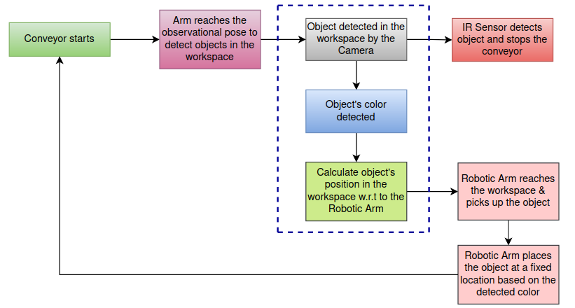

# NiryoRobot-OpenCV-ColorSorting
I have recently worked with the Niryo Robotic Arm (NED2). The arm is equipped with a camera and was capable of successfully sorting 
square-shaped objects based on color.

# Libraries required for the Simulator
The robotic arm only required pyniryo library to operate.

### Installing the Library

pyniryo:
```bash
pip install pyniryo
```

# Flowchart




