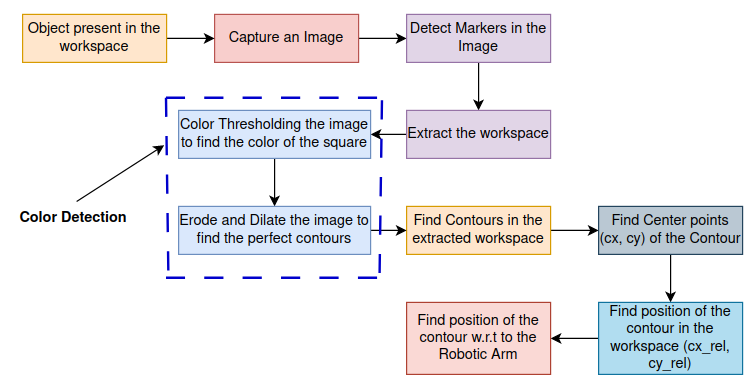
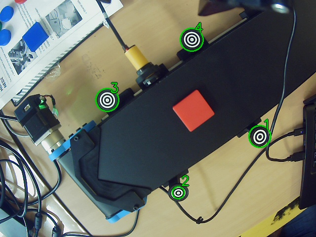

# NiryoRobot-OpenCV-ColorSorting
I have recently worked with the Niryo Robotic Arm (NED2). The arm is equipped with a camera and was capable of successfully sorting 
square-shaped objects based on color.

NiryoStudio should be installed beforehand, as it will be used to create the "workspace". Workspace is the area from which the arm will pick up the objects after detecting them. Connect the Robot with the NiryoStudio and create a workspace by going to Library > Workspaces > Create new.

Refer to the following link of Niryo Robot's documentation: [NED2 Documentation](https://docs.niryo.com/dev/pyniryo/v1.0.5/en/source/vision/image_processing_overview.html) 

# Libraries required for the Simulator
The robotic arm only required pyniryo library to operate.

### Installing the Library

pyniryo:
```bash
pip install pyniryo
```

# Flowchart
The below figure shows the flowchart of the system:


# Algorithm Flowchart
The algorithm works as follows:
1. Capture an Image,
2. detect markers
3. extract workspace
4. extract color features of the object
5. find object's position w.r.t to the Robot
6. Move the arm to pick up the object




The markers need to ber perfectly detected for the algorithm to work

